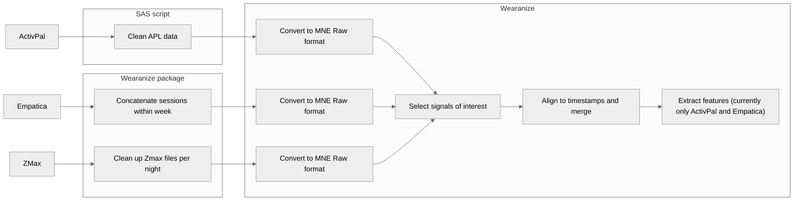

# wearanize
This is the Standard Operating Procedure (SOP) outlining the steps carried out for the processing of the wearable data collected from the [Healthy Brain Study](https://journals.plos.org/plosone/article?id=10.1371/journal.pone.0260952). This SOP serves to instruct researchers on how to run the analysis for this data, starting with the preprocessing using proprietary software and scripts, to using the **Wearanize** package developed for the integration of the different data streams. It also serves as an explanation to what steps are carried out to process the data.



# 1. Building the Environment

Having the correct environment is necessary for carrying out all processing steps for this data. We recommend the creation of a virtual python environment (for example, using Anaconda) to make sure the work is reproducible. To this end, we specify the required software below:

- Python 3.9>
- Hydnodyne Software for [ZMAX](https://hypnodynecorp.com/downloads.php)
- Wearanize  (i.e., this repository)

Note For DCCN: that the Hypnodyne software is available on windows PCs via the DCCN software center. 

In addition to the above software packages, you will also need to install the required python libraries from the supplied requirements.txt file of this repository. This can be done by downloading the repository, and using pip to install the requirements.

```bash
module load anaconda3
conda create --name wearanize_env python==3.9
source activate wearanize_env
pip install -r requirements.txt.
```

# 2. Preparing the data

Raw data needs to be prepared prior to processing. First, raw files need to be cleaned in order for them to processed. Each wearable requires its own set of cleaning steps outlined below. 

## Zmax:

In order to make the most out of the ZMAX data, you will first need to preprocess it. When the raw zmax files are zipped for the HBS study, some header information is lost. Using ZMAX EDF converter, we can reprocess the data to a new zipfile. This will result in a cleaner EDF file that contains some preprocessed data including a cleaned BVP signal necessary for synchronization. This needs to be done on a **Windows PC with the Hypnodyne suite installed** on it. Once Hypnodyne is  installed, you can use the below code to run the clean-up process. You can replace the project directory with that of the current data, and set the ***zmax_ppgparser_exe_path*** argument to the one on the current computer. You can also opt to overwrite the files if you so wish. 

```powershell
zmax_edf_merge_converter.exe "Y:\HB\data\example_subjects\data" --no_overwrite --temp_file_postfix="_TEMP_" --zipfile_match_string="_wrb_zmx_" --zipfile_nonmatch_string="_merged|_raw| - empty|_TEMP_" --exclude_empty_channels --zmax_lite --read_zip --write_zip --zmax_ppgparser --zmax_ppgparser_exe_path="C:\Program Files (x86)\Hypnodyne\ZMax\PPGParser.exe" --zmax_ppgparser_timeout=1000
```

Once complete, you will have a new zipped Zmax file for each recorded session with the ***_merged.zip*** suffix added to it. While this may require double  the space, it is advised to produce these files for optimal results. 

## Empatica E4:

While the E4 data can be used with functions within **wearanize** directly, it is advised to create a concatenated file for all subjects. This can be done in python using multiple cores for faster processing. The steps in this process include finding all E4 sessions within a certain week, and then concatenating the data for each data channels (Blood volume pulse,  Electrodermal Activity, Accelerometer, and Temperature). The following steps are run for each channel, and each session:

1. Reading the sampling rate and start time of the session
2. Generating a datetime column given start time and sampling rate, resulting in a data frame with two columns: timestamps, and data
3. Appending to a master data frame
4. Resorting master data frame by time

Once all sessions have been concatenated, a csv file is written in the same directory as the original data. Thus a single zip file with the suffix ****_full.zip**** will be created, containing all sessions for a given week, concatenated temporally. 

*Note for the DCCN compute cluster: You can start a multicore job on the cluster, and initialize your virtual environment of choice using the command below.*

```bash
qsub -I -l "walltime=12:00:00, mem=32gb, nodes=1:ppn=12" 
module load anaconda3
source activate wearanize_env
python
```

You can run the below code to run the concatenation function in parallel across all participants. You can also incorporate this code into another scrip if needed. You can specify if you would also like to overwrite existing concatenated data, or not to skip over participants that have been already processed.  

```python
from wearanize import e4_concatenate_par
project_folder = "/path/to/folder/with/all/subject"
e4_concatenate_par(project_folder, overwrite=False)
```

Alternatively, data can also be processed for subjects individually using the command below. 

```python
e4_concatenate(project_folder, sub_nr, resampling=None, overwrite=False)
```

## ActivPal:

The raw activpal data is downloaded directly via the activpal software, and processed with a proprietary SAS script. 

# 3. Synchronization

Synchronization is currently carried out using the recorded time stamps of the different data streams. We believe that the Activpal and Empatica data should be safely synchronized on this basis, however we are still unsure about the Zmax data. While we can also synchronize it based on the timestamps, more testing needs to be carried out before we are able to provide the data. Attempts to synchronize the Zmax to the Empatica using the accelerometer data have been unsuccessful, and we are currently testing an alternative using the blood volume pulse (BVP) from each device. Until that is available, we provide only the Activpal and Empatica synchronization. 

## 3.1. Data conversion

We have taken the MNE Raw format as the default format for all our data. More information on the MNE format can be found [here](https://mne.tools/stable/index.html). For each data stream (Empatica, Zmax, and ActivPal), data is converted into this raw format, which contains all channels of the data with sampling rates and date information stored as a header. For each data type, a custom function has been created to convert the data to this format.

- ZMAX: read_edf_to_raw
- E4: read_e4_to_raw
- Activpal: read_apl_to raw & read_apl_event_to_raw

The MNE format requires all channels have the same sampling rates. This poses and issue for the E4 and Activpal events data. The E4 contains separate channels each containing a different sampling rate. Therefore the files are all resampled to 32 Hz, with forward filling for the channels with lower sampling rates, and averaging for the data sampled at higher frequencies. Note that the default sampling rate and interpolation methods can be changed in the function arguments. Additionally, a channel named ***timestamp_ux*** is added to the MNE channel list for the E4 data when reading the concatenated file, as there may be gaps between the different concatenated sessions. This was done to reduce memory needed, as filling empty periods between sessions would drastically increase memory usage. 

The raw accelerometer data from the ActivPal files is also memory dense. While the functionality to use this data is added to the ******************Wearanize****************** package, it is not recommended to use it in combination with the other data streams. Instead, we utilize the events files generated in the preprocessing steps via SAS scripts, which are resampled to 1 second, providing event codes for the types of activities participants were engaged in. The resampled files are converted to MNE raw format, including step counts, and activity codes.

## 3.2. Data Synchronization

Synchronization of the different data streams is important for analysis. As such, two potential options exist: Either we take the time stamps at face value, or we have to find common underlying signals that we can cross correlate. To this end, we developed a cross-correlation method for looking at correlations between two different signals, and providing an adjustment factor for sampling rates to sync the signals. To this end, we require a “ground truth” signal to which we can synchronize the others. We accept an amount of error, but hold the  Empatica E4 data to be our ground truth, as this device is synced to a laptop participants have repeatedly throughout the experiment, providing with an update and corrected time stamp after each sync. 

Currently, we have attempted to sync accelerometer data from the ZMAX to the E4, with little success. Both devices also feature BVP sensors. Attempts to synchronize these two data sources has proven more successful, but with an adjust factor of  <1.01, it may be that such steps are not necessary. More work is being carried out to examine whether these data streams can be synced better, but currently we have adopted the timestamps for syncing instead. 

# 4. Feature Extraction

Feature extraction can be carried out with various functions for each modality of data. Extraction functions begin with the *features_* prefix. Functions require data to be in MNE Raw format. Processing can work on both continuous and discontinuous data to generate features in two ways: 

1. **Continuous:** Data is chunked into windows of N minutes (set to 10 as default) and feature extraction algorithms are applied, resulting in a pandas data frame object with extracted features, and timestamps for indicating the start time of the selected chunk.
2. **Relative to app:** Data is chunked into windows before, after, or around app data, and features extracted from these windows. Returns a pandas data frame object with features and timestamps corresponding to the start of the survey. 

Different methods are used for feature extractions from each device. These extraction methods are individual function that can be applied to any mne Raw signal, and thus have applications beyond the HBS as well. Feature extraction can be run on single subjects using the code below, or alternatively in parallel

```python
sub_feature_extraction(subject_file, weeks=['pre-1', 'pre-2','pre-3'], devices=['emp', 'apl'], channels=['eda', 'acc', 'temp', 'hr'], window=10, apl_window=60, apl_bout=10, app_data=True, app_window='before', output=True)
```

Below is a description of the processing steps and resulting features extract from each of the wearable devices.  

## 4.1. Empatica:

### EDA:

Electrodermal Activity (EDA) was processed from Empatica E4 following recommendation from Boucessein et al 2011. Processing was carried out using  the [PyPhysio package](https://github.com/MPBA/pyphysio). Data was first resampled to 8Hz and linear interpolation, before having spikes removed via a derivative function. A Kalman filter was used to denoise the data, based on findings from [Tronston et al, 2015](https://ieeexplore.ieee.org/document/7318961). A Bateman function was used to deconvolve the EDA signal, allowing the estimation of phasic and tonic components of the signal.

The following features were estimated from the tonic responses: 

- Mean levels
- Standard Deviation (SD)
- Range

The following features were estimated from the phasic responses: 

- Magnitude of Skin Conductance Response (SCRs)
- Duration of SCRs
- Number of SCRs
- AUC of SCR

The following quality metrics were derived for the EDA:  

- Slope of the signal, should be in range -10-10 us/sec
- Range of the signal, should be min=0.02 – max=60 usiemens.

### ACC:

3-axis accelerometer data is estimated based on [Zhu et. al 2017](https://link.springer.com/article/10.1186/s13673-017-0097-2), which offers a large set of features that have been used for recognition of physical activity. The features are listed below, and are derived for each of the X, Y, and Z axes:

- XYZ (3 signals): Original accelerometer signals.
- Mag (1 signal): Magnitude signal computed from the previous three signals. This magnitude is computed as the square root of the sum of squared components (accelerometer signals).
- Jerk-XYZ (3 signals): Jerk signals (derivative of the accelerometer signals) obtained from the original accelerometer signals.
- JerkMag (1 signal): Magnitude signal computed from the previous jerk signals (square root of the sum of squared components).

And in the frequency domain, the signals from the accelerometer sensor are:

- fXYZ (3 signals): Fast Fourier transforms (FFTs) from XYZ.
- fMag (1 signal): FFT from Mag.
- fJerk-XYZ (3 signals): FFTs from Jerk-XYZ.
- fJerkMag (1 signal): FFTs from JerkMag.

The set of features that were estimated from the time domain signals are:

- Mean value, standard deviation, median absolute deviation, minimum and maximum values of the samples in a frame.
- Signal Magnitude Area: The normalized integral of the samples in a frame.
- Energy measure: Sum of the squares samples divided by the number of samples in a frame.
- Inter-quartile range: Variability measure obtained by dividing a data set into quartiles.
- Signal entropy.
- Auto-regression coefficients with Burg order equal to four correlation coefficients between two signals

### Heart Rate:

HR was estimated from BVP signals using the package [RapidHRV](https://pubmed.ncbi.nlm.nih.gov/35345583/). Data was resampled to 32HZ, and Bandpass filtering (highpass=0.06 and lowpass=8) was applied. A 1-second sliding time window was used to estimate heart rate continuously, using moderate outlier detection as defined by RapidHRV, with a peak threshold of 30 for beat detection. Outliers were removed through truncation. The following features were then extracted:

Time-Domain:

- Beats per minute (BPM)
- Minimum
- Maximum

Frequency-Domain:

- Root Mean Square of Successive Differences (RMSSD)
- SDNN
- SDSD
- pNN20
- High Frequency components

### Temperature:

Data was processed using [PyPhysio package](https://github.com/MPBA/pyphysio). Spikes resulting from sudden shifts in wear were removed, and time domain features were estimated. Basic quality assessment was performed, and signal portions were temperature values were too high (45 degrees), or too low (15 degrees) were removed. These values indicate either watch malfunction, or non-wear, and can thus also be used for overall assessment of signal inclusion from other device sources. The estimated time domain features are as follows:

- Mean
- Minimum
- Maximum
- Slope

## 4.2. Activpal:

The Activpal records in information extracted from a thigh worn device. For the purpose of feature extraction, we utilize the Events file, which is converted into an MNE raw format resampled to 1 HZ. We then estimate the percentage of time spent in the activity codes as defined by ActivPal: 

- Code 0: Sedentary
- Code 1: Standing
- Code 2: Stepping
- Code 2_1: Cycling
- Code 3: Laying
- Code 3_1: Laying Primary
- Code 3_2: Laying Secondary
- Code 4: Non-wear time
- Code 5: Travelling

We additionally estimate other features. Using the first cumulative step count value and the last within a chunk, we estimate step counts. We apply a sliding time window to additionally estimate activity bouts (default=10min). The sliding time window will search a signal chunk for continuous periods of activity samples (defined as code 2 or code 2_1), and list the duration of said chunk, as well as giving a yes/no response to whether a bout of activity has occurred. This results in the following extra features:

- Step count within window
- Occurrence of exercise bout (yes/no)
- Duration of exercise bout

## 4.3. ZMAX

******************************Coming soon…******************************

## 4.4. Feature Keys

The results of the feature extractions are data frames that contain extracted features that can be used by researchers. All features are extracted from averages within mindows, unless they contain maxima or minima. Prefixes determine what kind of data the feature was extract from as follows:

- **hr_***:** Heart rate from blood volume pulse. More details on the different heart rate measures can be found [here](https://www.ncbi.nlm.nih.gov/pmc/articles/PMC5624990/).
- **eda_phasic_***:** Phasic component of the electrodermal activity. Measures here estimate non-specific skin conductance responses, which are an indicator of ANS activity.
- **eda_tonic_***:** Tonic component of the electrodermal activity. Indicates the average skin conductance levels during this period.
- **temp_***:** External skin based temperature features.
- **acc_mag/x/y/z_***:** Features from combined 3-axis accelerometer, and for each of the individual axes (x, y, z). The same features are extracted for all four measures (i.e., the combined measure, and for each axis). Only one set of features is presented below as an example for brevity. Replacing *********mag********* with either **x, y, or z** will give you the variable names for the individual axes. These same features are also estimated for the derivatives of the motion parameters, which have the addition of **acc_mag_deriv_***,** etc…
- **apl_***:** Features extracted from the Activpal events file.

| Variable Name | Definition |
| --- | --- |
| start_time | Start time of window used for processing |
| week_number | Randomized week number, used to anonymize data. Indicates if data occurred in different weeks. |
| week_day | Week day variable (1-7). 1=Monday and 7=Sunday |
| hr_bpm | Average beats per minute in window |
| hr_hf | High frequency HR component |
| hr_max | Maximum heart rate (truncated) |
| hr_min | Minimum heart rate (truncated) |
| hr_rmssd | Root mean squared of successive differences (truncated) |
| hr_sdnn | Standard deviation of NN intervals (truncated) |
| hr_sdsd | Standard deviation of RR intervals (truncated) |
| hr_pnn20 | Percentage of successive RR intervals that differ by more than 20 ms (truncated) |
| hr_pnn50 | Percentage of successive RR intervals that differ by more than 50 ms (truncated) |
| hr_window | Window length which averages were estimated in |
| eda_phasic_auc | Area under the curve of phasic SCRs |
| eda_phasic_duration | Duration of SCRs |
| eda_phasic_magnitude | Magnitude of SCRs |
| eda_phasic_mean | Mean of Phasic levels |
| eda_phasic_number | Number of SCR responses |
| eda_phasic_range | Range of SCR responses |
| eda_phasic_sd | SD of SCR responses |
| eda_qa_max | Maximum SC levels (for quality assessments) |
| eda_qa_min | Minimum SC levels (for quality  assessments) |
| eda_qa_slope | Slope of SC (for quality assessments) |
| eda_tonic_mean | Tonic SCL |
| eda_tonic_range | Range of SCL |
| eda_tonic_sd | SD of SCL |
| eda_window | Window length which averages were  estimated in |
| temp_max | Maximum skin temperature (also for  quality assessments) |
| temp_mean | Mean skin temperature |
| temp_min | Minimum skin temperature (also for quality assessments) |
| temp_slope | Slope of skin temperature, a measure of change |
| temp_window | Window length which averages were estimated in |
| acc_SMA | Signal magnitude area |
| acc_mag_ar_coef | First order autocorrelation coefficient for combined 3-axis movement |
| acc_mag_energy | Signal energy |
| acc_mag_entropy | Signal entropy |
| acc_mag_iqr | Inter-quartile range of derivative of 3-axis movement |
| acc_mag_maximum | Maximum movement in derivative of 3-axis movement |
| acc_mag_mean | Average Movement of derivative of 3-axis movement |
| acc_mag_median_abs_dev | Median absolute deviation of derivative of 3-axis movement |
| acc_mag_minimum | Minimum movement in derivative of 3-axis movement |
| acc_mag_sd | SD of movement in derivative of 3-axis movement |
| apl_bout_length_s | Duration of bout if one occurred |
| apl_bout_yn | Yes/No: Whether a bout occurred (defined as N number of continuous stepping and/or cycling |
| apl_per_cycling | Percentage of time spent cycling |
| apl_per_lay_prim | Percentage of time spent laying down in primary position |
| apl_per_lay_second | Percentage of time spent laying down in secondary position |
| apl_per_laying | Percentage of time spent laying down |
| apl_per_nonwear | Percentage of time spent in non-wear |
| apl_per_sedentary | Percentage of time spent sedentary |
| apl_per_standing | Percentage of time spent standing |
| apl_per_stepping | Percentage of time spent stepping |
| apl_per_travel | Percentage of time spent in travel |
| apl_window | Window used for APL data |
| apl_step_count | Number of steps taken in this window |